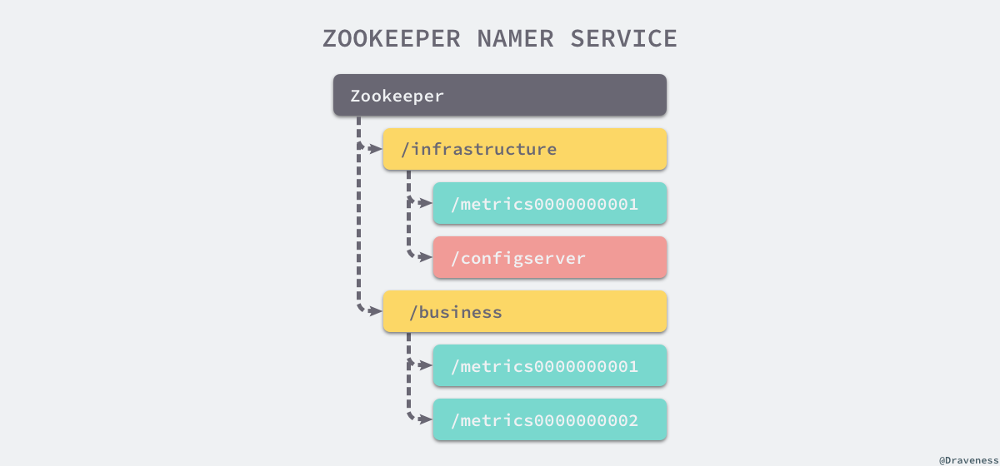

# [Zookeeper](https://draveness.me/zookeeper-chubby)

## 应用场景

### 发布订阅

通过 Zookeeper 进行数据的发布与订阅其实可以说是它提供的最基本功能，它能够允许多个客户端同时订阅某一个节点的变更并在变更发生时执行我们预先设置好的回调函数，在运行时改变服务的配置和行为

### 命名服务

除了实现服务配置数据的发布与订阅功能，Zookeeper 还能帮助分布式系统实现命名服务，在每一个分布式系统中，客户端应用都有根据指定名字获取资源、服务器地址的需求，在这时就要求整个集群中的全部服务有着唯一的名字。

在大型分布式系统中，有两件事情非常常见，一是不同服务之间的可能拥有相同的名字，另一个是同一个服务可能会在集群中部署很多的节点，Zookeeper 就可以通过文件系统和顺序节点解决这两个问题。

### 协调分布式事务

Zookeeper 的另一个作用就是担任分布式事务中的协调者角色，在之前介绍 分布式事务 的文章中我们曾经介绍过分布式事务本质上都是通过 2PC 来实现的，在两阶段提交中就需要一个协调者负责协调分布式事务的执行。

所有的事务参与者会向当前节点中写入提交或者终止，一旦当前的节点改变了事务的状态，其他节点就会得到通知，如果出现一个写入终止的节点，所有的节点就会回滚对分布式事务进行回滚。

### 分布式锁

在数据库中，锁的概念其实是非常重要的，常见的关系型数据库就会对排他锁和共享锁进行支持，而 `Zookeeper` 提供的 API 也可以让我们非常简单的实现分布式锁。

作为分布式协调服务，Zookeeper 的应用场景非常广泛，不仅能够用于服务配置的下发、命名服务、协调分布式事务以及分布式锁，还能够用来实现微服务治理中的服务注册以及发现等功能，这些其实都源于 Zookeeper 能够提供高可用的分布式协调服务，能够为客户端提供分布式一致性的支持。
