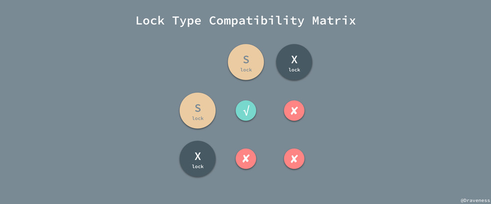

# [事务](https://draveness.me/mysql-transaction)

## 事务的特性

所谓事务，它是一个操作序列，这些操作要么都执行，要么都不执行，它是一个不可分割的工作单位。

### Atomicity（原子性）

 原子性是指事务是一个不可再分割的工作单位，事务中的操作要么都发生，要么都不发生。

### Consistency（一致性）

一致性是指在事务开始之前和事务结束以后，数据库的完整性约束没有被破坏。这是说数据库事务不能破坏关系数据的完整性以及业务逻辑上的一致性。

### Isolation（隔离性）

多个事务并发访问时，事务之间是隔离的，一个事务不应该影响其它事务运行效果。

这指的是在并发环境中，当不同的事务同时操纵相同的数据时，每个事务都有各自的完整数据空间。由并发事务所做的修改必须与任何其他并发事务所做的修改隔离。事务查看数据更新时，数据所处的状态要么是另一事务修改它之前的状态，要么是另一事务修改它之后的状态，事务不会查看到中间状态的数据。

### Durability（持久性）

 持久性，意味着在事务完成以后，该事务所对数据库所作的更改便持久的保存在数据库之中，并不会被回滚。

## 事务隔离级别

数据库是要被广大客户所共享访问的，那么在数据库操作过程中很可能出现以下几种不确定情况：

- **丢失修改**：两个事务T1，T2读入同一数据并修改，T2提交的结果被T1破坏了，导致T1的修改丢失。（订票系统）

- **不可重复读**：事务T1读取数据后，事务T2执行更新操作，使T1无法再次读取结果。
> 可以通过“读锁”和“写锁”解决不可重复读。读取数据的事务将会禁止写事务（但允许读事务），写事务则禁止任何其他事务。

- **读脏数据**：事务T1修改某个数据并写回磁盘，事务T2读取同一数据，但T1由于某种原因撤销了，这时T1修改过的数据恢复原来的值，T2读取的数据就与数据库中的数据不一致。

- **幻读**：事务在操作过程中进行两次查询，第二次查询结果包含了第一次查询中未出现的数据（这里并不要求两次查询SQL语句相同）**这是因为在两次查询过程中有另外一个事务插入数据造成的**。

为了避免上面出现几种情况在标准SQL规范中定义了4个事务隔离级别，不同隔离级别对事务处理不同 。

### 未提交读（Read Uncommitted）

未提交读(READ UNCOMMITTED)是最低的隔离级别。**允许脏读(dirty reads)，但不允许更新丢失，事务可以看到其他事务“尚未提交”的修改**。

### 提交读（Read Committed）

**允许不可重复读取，但不允许脏读取**。这可以通过“瞬间共享读锁”和“排他写锁”实现。**读取数据的事务允许其他事务继续访问该行数据，但是未提交的写事务将会禁止其他事务访问该行**。

### 可重复读（Repeatable Read）

**禁止不可重复读取和脏读取，但是有时可能出现幻读数据**。这可以通过“共享读锁”和“排他写锁”实现。读取数据的事务将会禁止写事务（但允许读事务），写事务则禁止任何其他事务。

### 可序列化(Serializable)

最高的隔离级别，**它要求事务序列化执行，事务只能一个接着一个地执行，不能并发执行**。仅仅通过“行级锁”是无法实现事务序列化的，必须通过其他机制保证新插入的数据不会被刚执行查询操作的事务访问到。

隔离级别越高，越能保证数据的完整性和一致性，但是对并发性能的影响也越大。

## 隔离级别的实现

数据库对于隔离级别的实现就是使用并发控制机制对在同一时间执行的事务进行控制，限制不同的事务对于同一资源的访问和更新，而最重要也最常见的并发控制机制，在这里我们将简单介绍三种最重要的并发控制器机制的工作原理。

### 锁

锁是一种最为常见的并发控制机制，在一个事务中，我们并不会将整个数据库都加锁，而是只会锁住那些需要访问的数据项， MySQL 和常见数据库中的锁都分为两种，共享锁（Shared）和互斥锁（Exclusive），前者也叫读锁，后者叫写锁。

读锁保证了读操作可以并发执行，相互不会影响，而写锁保证了在更新数据库数据时不会有其他的事务访问或者更改同一条记录造成不可预知的问题。

### 时间戳

除了锁，另一种实现事务的隔离性的方式就是通过时间戳，使用这种方式实现事务的数据库，例如 `PostgreSQL` 会为每一条记录保留两个字段；**读时间戳中包括了所有访问该记录的事务中的最大时间戳，而记录行的写时间戳中保存了将记录改到当前值的事务的时间戳**。

使用时间戳实现事务的隔离性时，往往都会使用乐观锁，**先对数据进行修改，在写回时再去判断当前值，也就是时间戳是否改变过，如果没有改变过，就写入，否则，生成一个新的时间戳并再次更新数据**，乐观锁其实并不是真正的锁机制，它只是一种思想，在这里并不会对它进行展开介绍。

### 多版本和快照隔离

通过维护多个版本的数据，数据库可以允许事务在数据被其他事务更新时对旧版本的数据进行读取，很多数据库都对这一机制进行了实现；因为 **所有的读操作不再需要等待写锁的释放，所以能够显著地提升读的性能**， `MySQL` 和 `PostgreSQL` 都对这一机制进行自己的实现，也就是 `MVCC` ，虽然各自实现的方式有所不同，MySQL 就通过提到的 `undo log` 实现了 MVCC，保证事务并行执行时能够不等待互斥锁的释放直接获取数据。

## ACID vs CAP

数据库对于 `ACID` 中的一致性的定义是这样的：如果一个事务原子地在一个一致地数据库中独立运行，那么在它执行之后，数据库的状态一定是一致的。对于这个概念，它的第一层意思就是对于数据完整性的约束，包括主键约束、引用约束以及一些约束检查等等，在事务的执行的前后以及过程中不会违背对数据完整性的约束，所有对数据库写入的操作都应该是合法的，并不能产生不合法的数据状态。

`CAP` 定理中的数据一致性，其实是说分布式系统中的各个节点中对于同一数据的拷贝有着相同的值；而 `ACID` 中的一致性是指数据库的规则，如果 schema 中规定了一个值必须是唯一的，那么一致的系统必须确保在所有的操作中，该值都是唯一的，由此来看 `CAP` 和 `ACID` 对于一致性的定义有着根本性的区别。

## 使用事务

在MySQL中使用`START TRANSACTION` 或 `BEGIN`开启事务，提交事务使用`COMMIT`，`ROLLBACK`用来放弃事务。MySQL默认设置了事务的自动提交，即一条SQL语句就是一个事务。

## 总结

事务的（ACID）特性是由关系数据库管理系统（RDBMS，数据库系统）来实现的。**数据库管理系统采用日志来保证事务的原子性、一致性和持久性**。日志记录了事务对数据库所做的更新，如果某个事务在执行过程中发生错误，就可以根据日志，撤销事务对数据库已做的更新，使数据库退回到执行事务前的初始状态。

**数据库管理系统采用锁机制来实现事务的隔离性**。当多个事务同时更新数据库中相同的数据时，只允许持有锁的事务能更新该数据，其他事务必须等待，直到前一个事务释放了锁，其他事务才有机会更新该数据。
