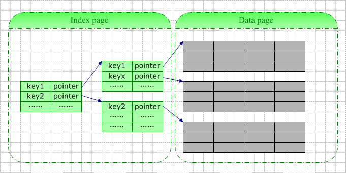
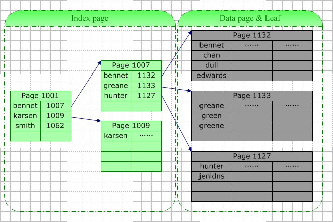
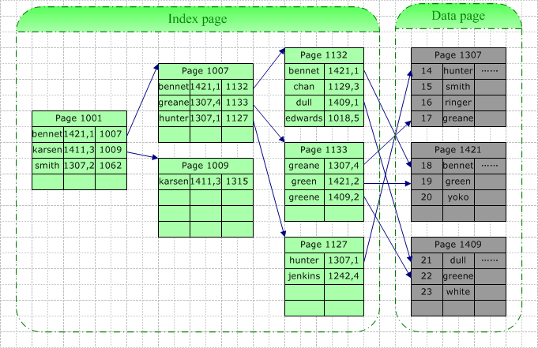

# [索引](http://www.cnblogs.com/morvenhuang/archive/2009/03/30/1425534.html)

## 基本概念

在数据库中，索引的含义与日常意义上的“索引”一词并无多大区别（想想小时候查字典），它是用于提高数据库表数据访问速度的数据库对象。

  - 索引可以避免全表扫描。多数查询可以仅扫描少量索引页及数据页，而不是遍历所有数据页。
  - 对于非聚集索引，有些查询甚至可以不访问数据页。
  - 聚集索引可以避免数据插入操作集中于表的最后一个数据页。
  - 一些情况下，索引还可用于避免排序操作。

## 索引的存储

一条索引记录中包含的基本信息包括：键值（即你定义索引时指定的所有字段的值）+逻辑指针（指向数据页或者另一索引页）。

当你为一张空表创建索引时，数据库系统将为你分配一个索引页，该索引页在你插入数据前一直是空的。此页此时既是根结点，也是叶结点。每当你往表中插入一行数据，数据库系统即向此根结点中插入一行索引记录。当根结点满时，数据库系统大抵按以下步骤进行分裂：

- 创建两个儿子结点
- 将原根结点中的数据近似地拆成两半，分别写入新的两个儿子结点
- 根结点中加上指向两个儿子结点的指针

通常状况下，由于索引记录仅包含索引字段值（以及4-9字节的指针），**索引实体比真实的数据行要小许多，索引页相较数据页来说要密集许多**。一个索引页可以存储数量更多的索引记录，这意味着在索引中查找时在I/O上占很大的优势，理解这一点有助于从本质上了解使用索引的优势。

## 索引的分类

>汉语字典的正文本身就是一个聚集索引。比如，我们要查“安”字，就会很自然地翻开字典的前几页，因为“安”的拼音是“an”，而按照拼音排序汉字的字典是以英文字母“a”开头并以“z”结尾的，那么“安”字就自然地排在字典的前部。如果您翻完了所有以“a”开头的部分仍然找不到这个字，那么就说明您的字典中没有这个字；同样的，如果查“张”字，那您也会将您的字典翻到最后部分，因为“张”的拼音是“zhang”。也就是说，字典的正文部分本身就是一个目录，您不需要再去查其他目录来找到您需要找的内容。正文内容本身就是一种按照一定规则排列的目录称为“聚集索引”。

>如果您认识某个字，您可以快速地从自动中查到这个字。但您也可能会遇到您不认识的字，不知道它的发音，这时候，您就不能按照刚才的方法找到您要查的字，而需要去根据“偏旁部首”查到您要找的字，然后根据这个字后的页码直接翻到某页来找到您要找的字。但您结合“部首目录”和“检字表”而查到的字的排序并不是真正的正文的排序方法，比如您查“张”字，我们可以看到在查部首之后的检字表中“张”的页码是672页，检字表中“张”的上面是“驰”字，但页码却是63页，“张”的下面是“弩”字，页面是390页。很显然，**这些字并不是真正的分别位于“张”字的上下方**，现在您看到的连续的“驰、张、弩”三字实际上就是他们在非聚集索引中的排序，是字典正文中的字在非聚集索引中的映射。我们可以通过这种方式来找到您所需要的字，但它需要两个过程，先找到目录中的结果，然后再翻到您所需要的页码。

### 聚集索引

表数据按照索引的顺序来存储的。**对于聚集索引，叶子结点即存储了真实的数据行，不再有另外单独的数据页**。在聚集索引中，叶结点也即数据结点，所有数据行的存储顺序与索引的存储顺序一致。

**在一张表上只能创建一个聚集索引，因为真实数据的物理顺序只可能是一种**。如果一张表没有聚集索引，那么它被称为“堆集”（Heap）。这样的表中的数据行没有特定的顺序，所有的新行将被添加的表的末尾位置。

### 非聚集索引

**表数据存储顺序与索引顺序无关**。对于非聚集索引，叶结点包含索引字段值及指向数据页数据行的逻辑指针，该层紧邻数据页，其行数量与数据表行数据量一致。

非聚集索引与聚集索引相比：

  - 叶子结点并非数据结点
  - 叶子结点为每一真正的数据行存储一个“键-指针”对
  - 叶子结点中还存储了一个指针偏移量，根据页指针及指针偏移量可以定位到具体的数据行。
  - 类似的，在除叶结点外的其它索引结点，存储的也是类似的内容，只不过它是指向下一级的索引页的。

## 索引失效

索引并不是时时都会生效的，比如以下几种情况，将导致索引失效：

  1. 如果条件中有or，即使其中有条件带索引也不会使用。
    >要想使用or，又想让索引生效，只能将or条件中的每个列都加上索引

  2. 对于多列索引，不是使用的第一部分，则不会使用索引。

  3. like查询是以%开头。

  4. 如果列类型是字符串，那一定要在条件中将数据使用引号引用起来，否则不使用索引。

  5. 如果 mysql 估计使用全表扫描要比使用索引快，则不使用索引。例如，使用`<>`、`not in` 、`not` `exist`，对于这三种情况大多数情况下认为结果集很大，MySQL就有可能不使用索引。

## 索引设计的原则

  - **表的某个字段值得离散度越高，该字段越适合选作索引的关键字**。主键字段以及唯一性约束字段适合选作索引的关键字，原因就是这些字段的值非常离散。

  - **占用存储空间少的字段更适合选作索引的关键字**。例如，与字符串相比，整数字段占用的存储空间较少，因此，较为适合选作索引关键字。

  - **存储空间固定的字段更适合选作索引的关键字**。与 text 类型的字段相比， char 类型的字段较为适合选作索引关键字。

  - **Where 子句中经常使用的字段应该创建索引，分组字段或者排序字段应该创建索引，两个表的连接字段应该创建索引**。

  - **更新频繁的字段不适合创建索引，不会出现在 where 子句中的字段不应该创建索引**。

  - 最左前缀原则。

  - 尽量使用前缀索引。

## 总结

聚集索引是一种稀疏索引，数据页上一级的索引页存储的是页指针，而不是行指针。而对于非聚集索引，则是密集索引，在数据页的上一级索引页它为每一个数据行存储一条索引记录。

与非聚集索引相比，聚集索引有着更快检索速度、更快的字段排序。

在MySQL中`InnoDB`按照主键进行聚集，如果没有定义主键，`InnoDB`会试着使用唯一的非空索引来代替。如果没有这种索引，`InnoDB`就会定义隐藏的主键然后在上面进行聚集，但是主键和聚集索引是不等价的。在`InnoDB`中`Normal`索引即非聚集索引。
