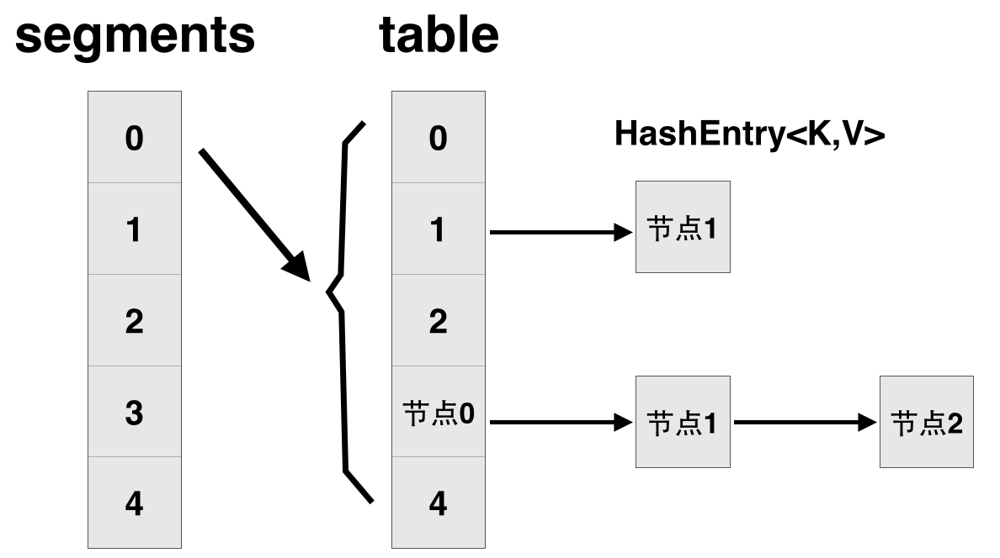

# ConcurrentHashmap

## JDK1.7

`ConcurrentHashMap`的锁分段技术：假如容器里有多把锁，每一把锁用于锁容器其中一部分数据，那么当多线程访问容器里不同数据段的数据时，线程间就不会存在锁竞争，从而可以有效的提高并发访问效率，这就是`ConcurrentHashMap`所使用的锁分段技术。首先将数据分成一段一段的存储，然后给每一段数据配一把锁，当一个线程占用锁访问其中一个段数据的时候，其他段的数据也能被其他线程访问。

> `ConcurrentHashMap`不允许`Key`或者`Value`的值为`NULL`



### Segment类

#### Put

将一个HashEntry放入到该`Segment`中，使用自旋机制，减少了加锁的可能性。

```Java
final V put(K key, int hash, V value, boolean onlyIfAbsent) {
    HashEntry<K,V> node = tryLock() ? null :
        scanAndLockForPut(key, hash, value); //如果加锁失败，则调用该方法
    V oldValue;
    try {
        HashEntry<K,V>[] tab = table;
        int index = (tab.length - 1) & hash; //同hashMap相同的哈希定位方式
        HashEntry<K,V> first = entryAt(tab, index);
        for (HashEntry<K,V> e = first;;) {
            if (e != null) {
        //若不为null，则持续查找，知道找到key和hash值相同的节点，将其value更新
                K k;
                if ((k = e.key) == key ||
                    (e.hash == hash && key.equals(k))) {
                    oldValue = e.value;
                    if (!onlyIfAbsent) {
                        e.value = value;
                        ++modCount;
                    }
                    break;
                }
                e = e.next;
            }
            else { //若头结点为null
                if (node != null) //在遍历key对应节点链时没有找到相应的节点
                    node.setNext(first);
                    //当前修改并不需要让其他线程知道，在锁退出时修改自然会
                    //更新到内存中,可提升性能
                else
                    node = new HashEntry<K,V>(hash, key, value, first);
                int c = count + 1;
                if (c > threshold && tab.length < MAXIMUM_CAPACITY)
                    rehash(node); //如果超过阈值，则进行rehash操作
                else
                    setEntryAt(tab, index, node);
                ++modCount;
                count = c;
                oldValue = null;
                break;
            }
        }
    } finally {
        unlock();
    }
    return oldValue;
}
```

#### scanAndLockForPut

该操作持续查找key对应的节点链中是否已存在该节点，如果没有找到已存在的节点，则预创建一个新节点，并且尝试n次，直到尝试次数超出限制，才真正进入等待状态，即所谓的 **自旋等待**。

```Java
private HashEntry<K,V> scanAndLockForPut(K key, int hash, V value) {
    //根据hash值找到segment中的HashEntry节点
    HashEntry<K,V> first = entryForHash(this, hash); //首先获取头结点
    HashEntry<K,V> e = first;
    HashEntry<K,V> node = null;
    int retries = -1; // negative while locating node
    while (!tryLock()) {  //持续遍历该哈希链
        HashEntry<K,V> f; // to recheck first below
        if (retries < 0) {
            if (e == null) {
                if (node == null) //若不存在要插入的节点，则创建一个新的节点
                    node = new HashEntry<K,V>(hash, key, value, null);
                retries = 0;
            }
            else if (key.equals(e.key))
                retries = 0;
            else
                e = e.next;
        }
        else if (++retries > MAX_SCAN_RETRIES) {
        //尝试次数超出限制，则进行自旋等待
            lock();
            break;
        }
        /*当在自旋过程中发现节点链的链头发生了变化，则更新节点链的链头，
        并重置retries值为－1，重新为尝试获取锁而自旋遍历*/
        else if ((retries & 1) == 0 &&
                 (f = entryForHash(this, hash)) != first) {
            e = first = f; // re-traverse if entry changed
            retries = -1;
        }
    }
    return node;
}
```

#### remove

用于移除某个节点，返回移除的节点值。

```Java
final V remove(Object key, int hash, Object value) {
    if (!tryLock())
        scanAndLock(key, hash);
    V oldValue = null;
    try {
        HashEntry<K,V>[] tab = table;
        int index = (tab.length - 1) & hash;
        //根据这种哈希定位方式来定位对应的HashEntry
        HashEntry<K,V> e = entryAt(tab, index);
        HashEntry<K,V> pred = null;
        while (e != null) {
            K k;
            HashEntry<K,V> next = e.next;
            if ((k = e.key) == key ||
                (e.hash == hash && key.equals(k))) {
                V v = e.value;
                if (value == null || value == v || value.equals(v)) {
                    if (pred == null)
                        setEntryAt(tab, index, next);
                    else
                        pred.setNext(next);
                    ++modCount;
                    --count;
                    oldValue = v;
                }
                break;
            }
            pred = e;
            e = next;
        }
    } finally {
        unlock();
    }
    return oldValue;
}
```

#### Clear

要首先对整个`segment`加锁，然后将每一个`HashEntry`都设置为`null`。

```Java
final void clear() {
    lock();
    try {
        HashEntry<K,V>[] tab = table;
        for (int i = 0; i < tab.length ; i++)
            setEntryAt(tab, i, null);
        ++modCount;
        count = 0;
    } finally {
        unlock();
    }
}
```

### Put

```Java
public V put(K key, V value) {
    Segment<K,V> s;
    if (value == null)
        throw new NullPointerException();
    int hash = hash(key); //求出key的hash值
    int j = (hash >>> segmentShift) & segmentMask;
    //求出key在segments数组中的哪一个segment中
    if ((s = (Segment<K,V>)UNSAFE.getObject           
         (segments, (j << SSHIFT) + SBASE)) == null)  
        s = ensureSegment(j); //使用unsafe操作取出该segment
    return s.put(key, hash, value, false); //向segment中put元素
}
```

### Get

```Java
public V get(Object key) {
    Segment<K,V> s;
    HashEntry<K,V>[] tab;
    int h = hash(key); //找出对应的segment的位置
    long u = (((h >>> segmentShift) & segmentMask) << SSHIFT) + SBASE;
    if ((s = (Segment<K,V>)UNSAFE.getObjectVolatile(segments, u)) != null &&
        (tab = s.table) != null) {  //使用Unsafe获取对应的Segmen
        for (HashEntry<K,V> e = (HashEntry<K,V>) UNSAFE.getObjectVolatile
                 (tab, ((long)(((tab.length - 1) & h)) << TSHIFT) + TBASE);
             e != null; e = e.next) { //找出对应的HashEntry，从头开始遍历
            K k;
            if ((k = e.key) == key || (e.hash == h && key.equals(k)))
                return e.value;
        }
    }
    return null;
}
```

### Size

求出所有的HashEntry的数目，**先尝试的遍历查找、计算2遍**，如果两遍遍历过程中整个Map没有发生修改（即两次所有Segment实例中modCount值的和一致），则可以认为整个查找、计算过程中Map没有发生改变。否则,需要对所有segment实例进行加锁、计算、解锁，然后返回。

```Java
public int size() {

   final Segment<K,V>[] segments = this.segments;
   int size;
   boolean overflow; // true if size overflows 32 bits
   long sum;         // sum of modCounts
   long last = 0L;   // previous sum
   int retries = -1; // first iteration isn't retry
   try {
       for (;;) {
           if (retries++ == RETRIES_BEFORE_LOCK) {
               for (int j = 0; j < segments.length; ++j)
                   ensureSegment(j).lock(); // force creation
           }
           sum = 0L;
           size = 0;
           overflow = false;
           for (int j = 0; j < segments.length; ++j) {
               Segment<K,V> seg = segmentAt(segments, j);
               if (seg != null) {
                   sum += seg.modCount;
                   int c = seg.count;
                   if (c < 0 || (size += c) < 0)
                       overflow = true;
               }
           }
           if (sum == last)
               break;
           last = sum;
       }
   } finally {
       if (retries > RETRIES_BEFORE_LOCK) {
           for (int j = 0; j < segments.length; ++j)
               segmentAt(segments, j).unlock();
       }
   }
   return overflow ? Integer.MAX_VALUE : size;
}
```

## JDK1.8

在JDK1.8中对ConcurrentHashmap做了两个改进：

  - 取消`segments`字段，直接采用`transient volatile HashEntry<K,V>[] table`保存数据，**采用table数组元素作为锁，从而实现了对每一行数据进行加锁，进一步减少并发冲突的概率**。

  - 将原先 **table数组＋单向链表** 的数据结构，变更为 **table数组＋单向链表＋红黑树** 的结构。对于hash表来说，最核心的能力在于将key hash之后能均匀的分布在数组中。如果hash之后散列的很均匀，那么table数组中的每个队列长度主要为0或者1。但实际情况并非总是如此理想，虽然ConcurrentHashMap类默认的加载因子为0.75，但是在数据量过大或者运气不佳的情况下，还是会存在一些队列长度过长的情况，如果还是采用单向列表方式，那么查询某个节点的时间复杂度为O(n)；因此，对于个数超过8(默认值)的列表，jdk1.8中采用了红黑树的结构，那么查询的时间复杂度可以降低到O(logN)，可以改进性能。
